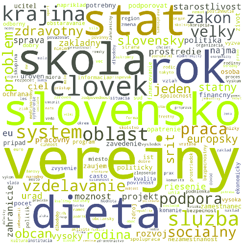

# Wordclouds for Slovak parliamentary election 2016

## Results
**Smer**

**Sieť**

**KDH**

**OĽaNO**

**Most-Hid**

## Sources
### Stopwords
https://code.google.com/p/stop-words/

http://vi.ikt.ui.sav.sk/@api/deki/files/449/=stopwords_file.txt

### Lemmatizer
http://text.fiit.stuba.sk/lemmatizer/

### Diacritics remover
http://www.diakritika.rs-design.sk/

### Programy
http://most-hid.sk/sk/program

http://www.obycajniludia.sk/ciele-a-vizia-hnutia/

http://www.obycajniludia.sk/wp-content/uploads/2015/12/zmluva-so-slovenskom.jpg

http://strana-smer.sk/priority-programu-strany-smer-sd-pre-roky-2016-2020-0

http://kdh.sk/wp-content/uploads/2016/01/volebny_program_web.pdf

http://siet.sk/program/
